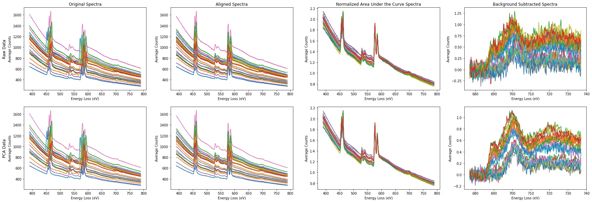

# logicalEELS
TensorFlow Framework for classification of EELS data with embedded theoretical structures.

### Research Article:
Hollenbach, J.D., Pate, C.M., Jia, H. et al. Real-time tracking of structural evolution in 2D MXenes using theory-enhanced machine learning. Sci Rep 14, 17881 (2024)\
<https://doi.org/10.1038/s41598-024-66902-4>

## Requirements:

The main package requirements and the version used for testing are below:

TensorFlow - 2.11.0\
Hyperspy - 1.7.3\
Sci-Kit Learn - 0.24.2

### Importing Data:

The first step is to isolate the specific EELS energy edge in the dataset for the specific energy edge of interest. The code for isolating and saving this dataset can be found in the [import data notebook](./import_eels_dataset.ipynb). This takes in 3D EELS Spectrum Images as `.dm4` files generated from [Digital Micrograph](https://www.gatan.com/products/tem-analysis/gatan-microscopy-suite-software) using the [Hyperspy Package](https://hyperspy.org).

### Training the Model:

With the dataset preprocessed, the [train notebook](./train.ipynb) will walk through the process of training the dual VAE. The model creation code can be seen in the [source code](./logicalEELS/models.py).

### Analysis:

After saving the trained model

### Latency Analysis:

Model Runtime can be measured using the [latency test script](./latency_test.py). This tests specifically the standard autoencoder runtime for N runs and returns the average runtime. A warmup run is performed before the test for runtime consistency.
